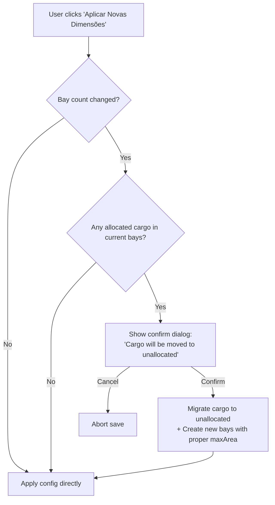

I have created the following plan after thorough exploration and analysis of the codebase. Follow the below plan verbatim. Trust the files and references. Do not re-verify what's written in the plan. Explore only when absolutely necessary. First implement all the proposed file changes and then I'll review all the changes together at the end.

# Implementation Plan — CargoDeck-PRO Issues

## Observations

The `Review___App_SPEC_Breakdown.md` documents **5 critical bugs**. After inspecting all relevant source files, I can confirm each issue:
1. **Auto-save hydration race**: The `SIGNED_IN` auth event handler does not reset `isHydratedFromCloud` before re-loading, allowing stale auto-saves during login.
2. **Cargo deletion never reaches backend**: `deleteCargo` mutates state first, then tries to find the cargo in the already-filtered state — `foundCargo` is always `undefined`.
3. **Stale aggregates in `updateCargo`**: `reduce` runs on `bay.allocatedCargoes` (pre-update array) instead of the post-map array.
4. **Bay count change drops cargo silently**: New bays are created with `maxAreaSqMeters: 0` and empty cargo, no confirmation or migration.
5. **Quantity omitted in UI area calculation**: `DroppableBaySide` calculates area as `w × l` without `× quantity`.

## Approach

Each fix is isolated, touching at most 2–3 files. I will order them by risk and dependency: the hydration guard first (safety net), then the data-loss bugs (deletion, aggregates, bay count), and finally the UI calculation fix. All changes follow existing Zustand + React patterns already established in the codebase.

---

## Step 1 — Fix auto-save hydration race (Comment 1)

**File:** `file:src/hooks/useAuthAndHydration.ts`

Inside the `onAuthStateChange` callback for the `SIGNED_IN` event (around line 62), **before** calling `loadStowage()`:
- Call `setHydrationStatus(false)` to block auto-save while new cloud data is loading.

Inside the `loadStowage` async function (around line 65–85):
- After the `try/catch` block completes (both success and failure paths), call `setHydrationStatus(true)` — mirroring the pattern already used in `fetchUserData`.

This ensures that each new sign-in resets the hydration guard, preventing the 3-second auto-save timer from overwriting remote data mid-load.

> **No changes needed** in `file:src/hooks/useAutoSave.ts` or `file:src/infrastructure/DatabaseService.ts` — the guard check (`if (!isHydratedFromCloud) return`) and the `setHydrationStatus` action already exist.

---

## Step 2 — Fix cargo deletion not reaching backend (Comment 2)

**File:** `file:src/features/cargoStore.ts` — `deleteCargo` method (line 518)

The current flow is:
1. `set(...)` filters the cargo out of state (**mutation**)
2. `get()` tries to find the cargo in the now-empty state → always `undefined`
3. `DatabaseService.deleteCargo` is never called

**Fix:** Capture the `cargoId` **before** the state mutation and use it directly.

- Remove the post-mutation lookup block (lines 537–553).
- After the `set(...)` call, immediately call `DatabaseService.deleteCargo(cargoId)` using the `cargoId` parameter that was passed into the function — there is no need to re-discover it.
- Wrap the `DatabaseService.deleteCargo` call in a `try/catch` and log on failure (keep the existing pattern of not throwing since local state is already updated).
- Optionally, add a compensating retry using the existing `file:src/utils/retry.ts` utility if the backend call fails.

---

## Step 3 — Fix stale bay aggregates in `updateCargo` (Comment 3)

**File:** `file:src/features/cargoStore.ts` — `updateCargo` method (line 156)

The bug: `currentWeightTonnes` and `currentOccupiedArea` are computed from `bay.allocatedCargoes` (the **old** array), not from the **updated** array produced by `map`.

**Fix:** Compute the updated cargo list first, then derive aggregates from it:

1. Inside the `bays.map(bay => ...)` callback, first compute a local variable for the updated cargo array:
   - `const updatedCargoes = bay.allocatedCargoes.map(c => c.id === id ? { ...c, ...updates } : c)`
2. Then return the bay object using `updatedCargoes` for all three fields:
   - `allocatedCargoes: updatedCargoes`
   - `currentWeightTonnes: updatedCargoes.reduce((acc, c) => acc + (c.weightTonnes * c.quantity), 0)`
   - `currentOccupiedArea: updatedCargoes.reduce((acc, c) => acc + (c.lengthMeters * c.widthMeters * c.quantity), 0)`

This ensures aggregates always reflect the latest cargo values.

---

## Step 4 — Fix bay count change causing silent data loss (Comment 4)

### 4a — Migrate cargo to unallocated + compute proper `maxAreaSqMeters`

**File:** `file:src/features/cargoStore.ts` — `updateActiveLocationConfig` method (line 235)

When `newConfig.numberOfBays !== loc.bays.length` (line 242):

1. **Collect displaced cargo**: Before creating new bays, gather all `allocatedCargoes` from existing bays into a flat array. Reset their `status` to `'UNALLOCATED'`, clear `bayId`, `positionInBay`, `x`, and `y`.
2. **Prepend displaced cargo** to `unallocatedCargoes` in the returned state object.
3. **Compute `maxAreaSqMeters`** for new bays using deck dimensions. Use `bayLengthMeters` (or `newConfig.lengthMeters / newConfig.numberOfBays`) multiplied by `newConfig.widthMeters` (total deck width), matching the same formula used in `DroppableBaySide`. Replace the current hard-coded `0`.
4. Keep `maxWeightTonnes` at `150` (existing default).

### 4b — Add a confirmation dialog before destructive changes

**File:** `file:src/ui/DeckSettingsModal.tsx` — `handleSave` function (line 37)

Before calling `updateActiveLocationConfig`:

1. Check if the new `baysCount` differs from `activeLocation.config.numberOfBays`.
2. If it does, and there are allocated cargoes in any existing bay, show a `window.confirm()` warning the user that all allocated cargo will be moved to the unallocated list.
3. Only proceed with `updateActiveLocationConfig` if the user confirms (or if no cargo is affected).



---

## Step 5 — Fix side occupancy ignoring cargo quantity (Comment 5)

**File:** `file:src/ui/DeckArea.tsx` — `DroppableBaySide` component (line 90)

Change the `currentOccupiedArea` calculation from:
```
cargoes.reduce((acc, c) => acc + (c.widthMeters * c.lengthMeters), 0)
```
to include `c.quantity`:
```
cargoes.reduce((acc, c) => acc + (c.widthMeters * c.lengthMeters * c.quantity), 0)
```

This aligns the UI display with the store's aggregate formula used in `moveCargoToBay`, `deleteCargo`, and the corrected `updateCargo` (Step 3).

---

## Summary of Changes by File

| File | Steps | Nature of Change |
|------|-------|------------------|
| `file:src/hooks/useAuthAndHydration.ts` | 1 | Reset + set hydration flag around SIGNED_IN load |
| `file:src/features/cargoStore.ts` | 2, 3, 4a | Fix deletion, fix stale aggregates, migrate cargo on bay change |
| `file:src/ui/DeckSettingsModal.tsx` | 4b | Add confirmation before destructive bay count change |
| `file:src/ui/DeckArea.tsx` | 5 | Multiply area by `quantity` in side occupancy |